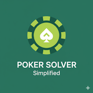

# Simplified Poker Solver App using React

Interactive React app that computes saddle points for classic simplified poker variants. Enter ante, bet, and deck size to compare the von Neumann and Borel strategy solvers and inspect the optimal betting decisions in the results table.

This project uses [Vite](https://vitejs.dev/).

## Available Scripts

In the project directory, you can run:

### `npm start`

Runs the app in the development mode.\
Open [http://localhost:3000](http://localhost:3000) to view it in your browser.

### `npm test`

Launches the test runner (Vitest) in the interactive watch mode.

### `npm run build`

Builds the app for production to the `build` folder.\
It correctly bundles React in production mode and optimizes the build for the best performance.

The build is minified and the filenames include the hashes.\
Your app is ready to be deployed!

## Learn More

You can learn more in the [Vite documentation](https://vitejs.dev/guide/).

To learn React, check out the [React documentation](https://reactjs.org/).
