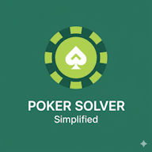

# Simplified Poker Solver App using React

Interactive React app that computes saddle points for classic simplified poker variants. Enter ante, bet, and deck size to compare the von Neumann and Borel strategy solvers and inspect the optimal betting decisions in the results table. Refer to the [POKER-BACKGROUND.md](POKER-BACKGROUND.md) file for more information.

## Bringing up the application

You can also run this application using Docker.

### Docker Prerequisites

- [Docker](https://docs.docker.com/get-docker/)
- [Docker Compose](https://docs.docker.com/compose/install/)

### Running with Docker Compose

1. Build/Rebuild and start the container: `docker compose up -d --build`
1. Open [http://localhost:8080](http://localhost:8080) in your browser.
1. To stop the container: `docker compose down`

## Learn More

This project uses [Vite](https://vitejs.dev/). You can learn more in the [Vite documentation](https://vitejs.dev/guide/).

To learn React, check out the [React documentation](https://reactjs.org/).
